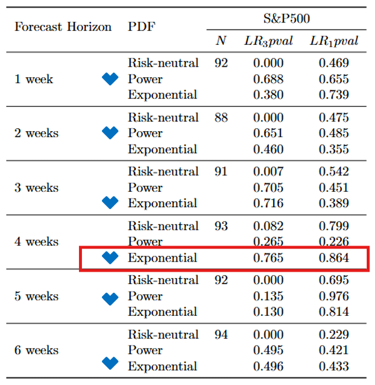
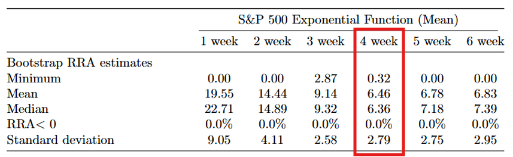

#  風險趨避係數估計

本專案依據 Robert R. Bliss 與 Nikolaos Panigirtzoglou (2005, Journal of Finance) 的方法，利用金融市場中選擇權價格所隱含的風險中性機率密度函數，結合實際機率密度，反推出市場整體的風險趨避係數（Relative Risk Aversion, RRA）。

風險趨避係數可應用於：

- 市場未來波動性的分析與預測

- 保險商品的精算定價

- 消費者對保險商品的需求分析

---

## 專案結構
- ESDF_US_exp_4_week.ipynb，利用4個月後到期的選擇權估算風險趨避指數
- S&P500_option_2013_2022_28.csv，距到期日28日的S&P500選擇權資料
- S&P_Price.csv，S&P500指數
- risk_free_rate.csv，無風險利率(美國國庫券30天期利率) 

---

## 模型篩選
- 篩選 LR3 與 LR1 p 值較高的模型，無法拒絕虛無假設（H₀：股價報酬於時間上獨立）。
- 透過 bootstrap 檢定，選定到期日為 4 個月的選擇權，並選擇指數型效用函數。
- 四個月以上的資料無法使用，因其時間序列相關。

---
## 結論
- 本專案成功估計出特定時間段內市場的風險趨避係數，並透過 Bootstrap 測試以提升估計結果的穩健性。
- 
--- 
## 優化目標
- 實際分析保險需求與風險趨避係數之關係
---

##  參考文獻
- Bliss, R. R., & Panigirtzoglou, N. (2005). *Option-Implied Risk Aversion Estimates*. Journal of Finance, 60(1), 258–281.
